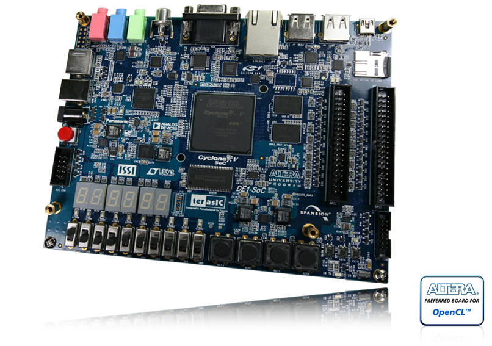

# FPGA Learning Journey - Implementing Encryption Standards

This project serves to outline my journey in learning verilog and implementing an encryption standard, such as AES, on an FPGA.

The larger scope of this project is an extension of an Independent Study being conducted at the United States Military Academy, extending the field of open source chip design with Google's efabless project. However, before building and designing a chip, a large part of the time will be spent learning verilog and learning the AES encryption standard. If time allows, other encryption standards will be implemented, such as Twofish and Serpent.

For more information on the chip design, see [the open shuttle program](https://efabless.com/open_shuttle_program) program by efabless.

Because FPGAs vary in terms of tools needed to compile, software needed to change pin assignments, etc., I'm going to demonstrate the verilog code as I learn with an FPGA used previously in a computer architecture class at USMA: The DE1-SoC FPGA board.

## DE1-SoC FPGA Board
This board will serve as the testing device for all verilog projects. The proof on concept will be proven here before being moved to a chip. For more information on the board, visit [their website](https://www.terasic.com.tw/cgi-bin/page/archive.pl?Language=English&No=836).



This development board comes with both an FPGA and a soft core Cortex-A9 chip, providing a range of capabilities. For this project, we are only going to be working with the FPGA piece. The FPGA has access to the switches, buttons, seven-segment displays, and more. We'll be using those to prove concepts such as random number generators and more.

## Project Organization
The organization of this project will be as follows:

Every project I try to complete, I'll have a folder along with the name of the timeline so that the order of the projects are sequential. For example:
```text
verilog_encryption_project
    |
    -> '1_getting_started'
            |
            -> getting_started.v
            |
            -> README.md
    -> '2_4_bit_counter'
            |
            -> 4_bit_counter.v
            |
            -> README.md
```

Every folder will contain a project that correlates to a test that I'm learning. The ```README.md``` file will outline my thought process on getting the project to work, and how I went about learning the necessary parts needed to work. Any issues or problems I run into will be addressed in the README as well, so that as I progress I can keep documentation for everything completed.

The first project will start with creating a half-adder circuit. For most of the start of my journey, I'm using the [FPGA Designs with Verilog and SystemVerilog](https://verilogguide.readthedocs.io/en/latest/verilog/firstproject.html) guide to learn specifically how to upload and work with verilog and the DE1-SoC board I'm using, in addition to the youtube playlist [Shawn Hymel's Introduction to FPGAs](https://www.youtube.com/playlist?list=PLEBQazB0HUyT1WmMONxRZn9NmQ_9CIKhb).

Any other resources used for me to learn this will be described in the ```README.md``` file at the bottom. 

## FAQ

1. What should I use to view verilog files?
   * Typically I use Notepad++ for simple file viewing. Once projects get more complicated, I plan on using VSCode (I use PlatformIO for my embedded work, so it will be easy and familiar for me to use). Most IDEs can view verilog, but you might have to go into the details to see if the one you want to use supports it.
2. Where do I start?
   * I would definitely start with the video tutorial series by Shawn Hymel linked above as well as the FPGA Designs with Verilog guide even if you don't have the DE1-SoC board. It provides many useful projects that you can see in addition to what I'll be working on. My goal is to document and show how I went through learning verilog and specifically with FPGAs.